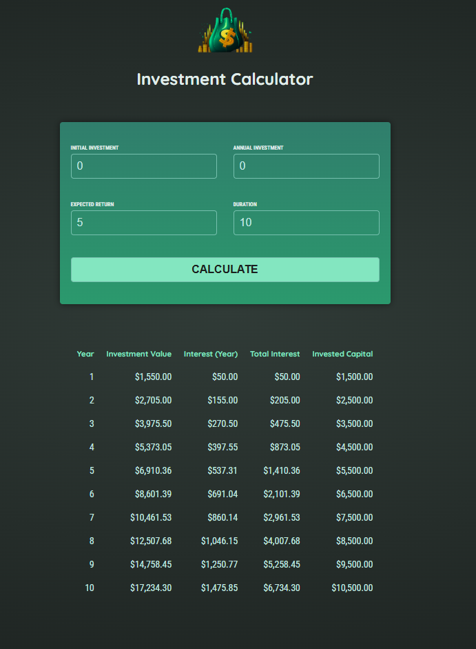

# Investments Calculator

## General View

**Investments Calculator** is a small project in Angular to simulate a investment return based on duration, expected return, annual investment and initial investment. This project was develop while learning Angular in the following course:

https://www.udemy.com/course/the-complete-guide-to-angular-2/

## Functionalities

- **Caculate an Investment:** Calculates the values input by the user.

## Final Result

View of the application running:

<div align="center">
  
</div>

## How to Run the project

Follow the next steps to run Investment Calculator on your machine:

### Prerequisites

- [Node.js](https://nodejs.org/) (version 20.13.1 or higher)
- [Angular CLI](https://angular.io/cli) (version 18 or higher)

### Steps

1. **Clone the Repository:**

   ```sh
   git clone https://github.com/pedrogomes0008/Investment-Calculator.git
   cd Investment-Calculator

2. **Install Dependecies:**
   
   ```sh
   npm install

3. **Run the Project:**
   
   ```sh
   npm start